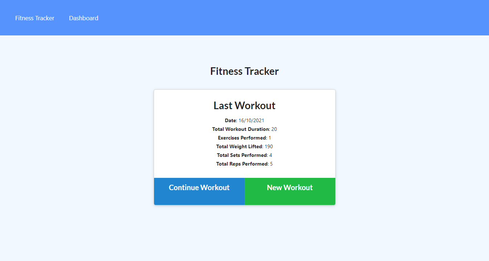

# Workout Tracker 

[Project Repo](https://github.com/kevinjr1998/Workout_Tracker)

[Deployed Application](https://dry-citadel-64212.herokuapp.com)

## Description

This website is a full stack web application that allows users to track their workout data. It uses `MongoDB` as the database, which holds the information that gets displayed in the application. The homepage will display links to the tracker and the dashboard, and will show the data from your last workout session, as well as the options to either continue the workout or start a new one. When either of these options are clicked, you are taken to a page where you can add a workout, either cardio or resistance training. once you have filled these in, you are able to save the workout and be taken to the homepage, or continue adding exercises. The stats page contains statistics about the last week of workouts you performed, including the length of the workout and the total weight lifted. 

## Table Of Contents

  - [Installation](#installation)
  - [Usage](#usage)
  - [Credits](#credits)
  - [License](#license)
  - [Questions](#questions)

## Installation

To install your own version that works locally, first, clone the repo to your local repository. Once you ahve done this, type `npm i` while in the root of the folder to install all dependencies. make sure you have `MongoDB` installed on your device (and optionally `Robo 3T`). Then you can seed the database by typing `npm run seed` to seed your and then `npm start` to run the server, and access the application at `localhost:3000`

To deploy your own version of the application, make sure you have a heroku account and a `MongoAtlas` database set up. Follow [these instrucions](https://devcenter.heroku.com/articles/git), to deploy your application to heroku. Once you have done this, go to your MongoAtlas database and find the option to connect application and copy the connection string. Update the connection string with your unsername, password and database name and go to the heroku page that relates to your application. on the setting stab, find the config vars section and in the `KEY` section, enter `MONGODB_URI` and in the `VALUE` section, enter your updated connection string. This sets up the key-value pair for the connection string. If this has been done correclty, you should be able to connect to the console for this hosted app and try to seed the database. If this seeds without erorrs, everything has been set up correclty and you should be able to use the application!

## Usage

## License

This application is covered under the MIT License 

[License Link](https://opensource.org/licenses/MIT)

## Questions

If you have any questions, please contact me at kevinryner@yahoo.co.uk